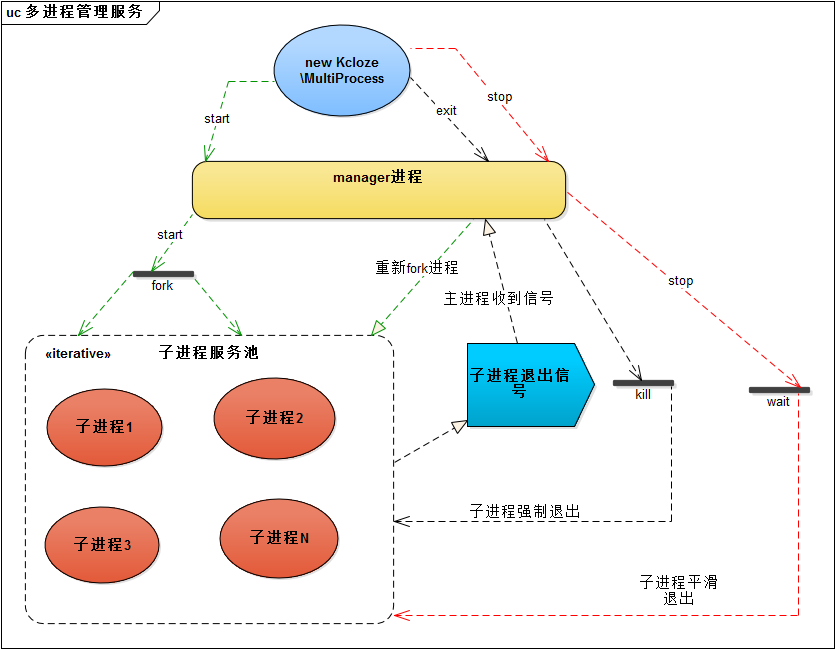
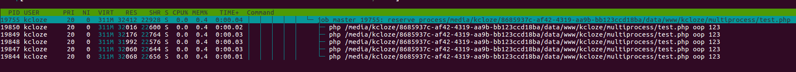

# multiprocess [[中文文档]](README.md)

* Based on swoole script management, for multi-process and daemon management
* Easy to make the common PHP script change daemon and multi-process execution
* The number of processes can be configured and multiple commands can be executed at once
* Automatic restart when the child process exits in an abnormal way
* When the main process exits in an abnormal way, the sub-process exits (smoothing out) after the work is done.
* Not limited programming language, PHP/Python/Java/Golang/C# and other scripts can be managed


## Scenario

* PHP requires running one or more cli script consumption queues (resident)
* The implementation of the script automatically pulls up after the exit, preventing the consumption queue from working, affecting the business
* In fact, the supervisor can easily do something, this is just another implementation of PHP, no need to change the technology stack

## Flow



## Installation
* git clone https://github.com/kcloze/multiprocess.git
* composer install
* modify config.php based on your business configuration


## Configure the instance
* Execute multiple commands at once
```
    'logPath'   => __DIR__ . '/log',
    'exec'      => [
        [
            'name'      => 'kcloze-test-1',
            'bin'       => '/usr/bin/php',
            'binArgs'   => [__DIR__ . '/test/test.php', 'oop', '123'],
            'workNum'   => 3,
        ],
        [
            'name'      => 'kcloze-test-2',
            'bin'       => '/usr/bin/php',
            'binArgs'   => [__DIR__ . '/test/test2.php', 'oop', '456'],
            'workNum'   => 5,
        ],
        [
            'name'      => 'kcloze-test-3',
            'bin'       => '/usr/bin/python',
            'binArgs'   => [__DIR__ . '/test/test3.py', 'oop', '369'],
            'workNum'   => 2,
        ],
    ],

```
## Running

### 1.start
* chmod -R u+r log/
* php multiprocess.php start >> log/worker.log 2>&1
### 2.stop
* php multiprocess.php stop
### 3.exit
* php multiprocess.php exit
### 4.restart
* php multiprocess.php restart >> log/worker.log 2>&1
### 5.monitor
* ps -ef|grep 'multi-process'

### Command
```
NAME
      php multiprocess - manage multiprocess

SYNOPSIS
      php multiprocess -s command [options] -c config file path
          Manage multiprocess daemons.


WORKFLOWS


      help [command]
      Show this help, or workflow help for command.

      -s restart
      Stop, then start multiprocess master and workers.

      -s start 
      Start multiprocess master and workers.
      -s start -c ./config
      Start multiprocess with specail config file.


      -s stop
      Wait all running workers smooth exit, please check multiprocess status for a while.

      -s exit
      Kill all running workers and master PIDs.

```


## Monitor



## Change log

#### 2017-11-30
* Refactor mercilessly v2 version 
* Add exit param，waiting for the child processes run over


## Thanks

* [swoole](http://www.swoole.com/)

## Contact

QQ group：141059677

